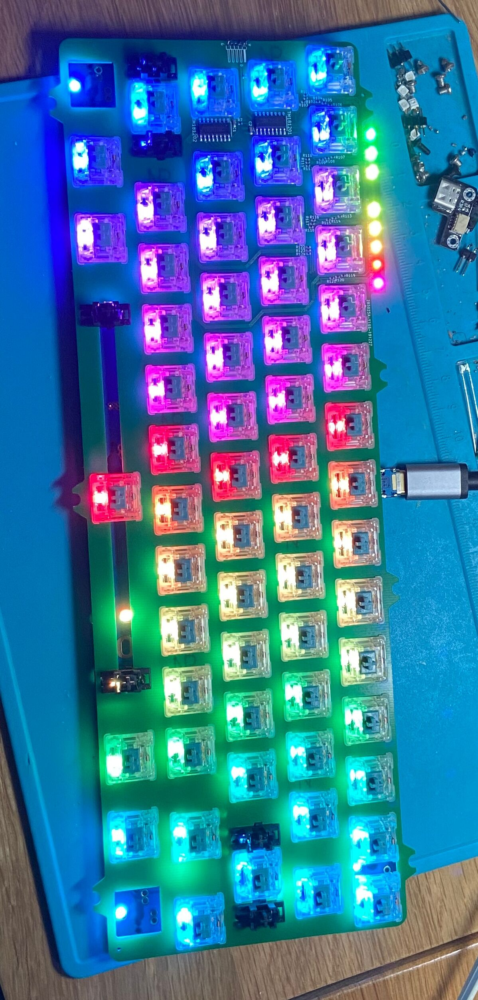

# Plate for the viper or eagle keyboard

This plate uses 8 [rgb leds](https://item.szlcsc.com/391391.html) to replace the 
indicator leds on the original viper/eagle pcb.

Two [TM1812](https://item.szlcsc.com/62468.html) were used to drive those leds. The 
protocol of TM1812 was almost the same as the WS2812 family, thus it's easy to integrate
with commonly avaibly GH60 boards such as the DP60.

